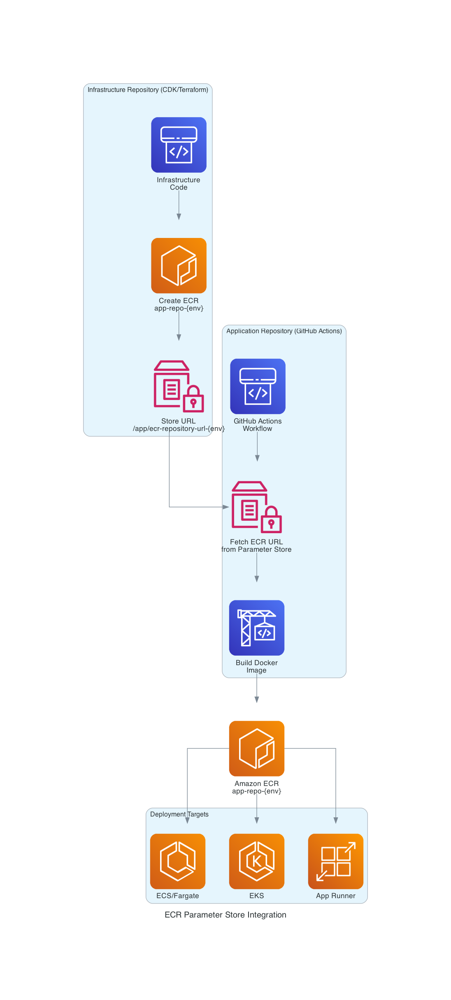
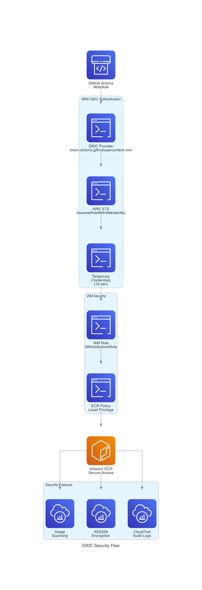

# Spotlight

Spotlight is a [Tailwind Plus](https://tailwindcss.com/plus) site template built using [Tailwind CSS](https://tailwindcss.com) and [Next.js](https://nextjs.org).

## Getting started

To get started with this template, first install the npm dependencies:

```bash
npm install
```

Next, create a `.env.local` file in the root of your project and set the `NEXT_PUBLIC_SITE_URL` variable to your site's public URL:

```
NEXT_PUBLIC_SITE_URL=https://example.com
```

Next, run the development server:

```bash
npm run dev
```

Finally, open [http://localhost:3000](http://localhost:3000) in your browser to view the website.

## Customizing

You can start editing this template by modifying the files in the `/src` folder. The site will auto-update as you edit these files.

## Testing

This project has comprehensive test coverage with 247 tests:

```bash
# Run all tests
yarn test

# Run tests with coverage
yarn test --coverage

# Run tests in watch mode
yarn test --watch

# Run linter
yarn lint
```

## Deployment

This project uses GitHub Actions to automatically build, test, and deploy Docker images to Amazon ECR. The ECR repository is managed by your infrastructure repository and accessed via AWS Parameter Store.

### Architecture



The infrastructure repository creates the ECR repository and stores its URL in Parameter Store (`/app/ecr-repository-url-{env}`). This application repository fetches the URL dynamically during deployment.

### Quick Start

- **Setup Guide:** [docs/QUICK_START.md](docs/QUICK_START.md)
- **Parameter Store Integration:** [docs/PARAMETER_STORE_QUICK_REFERENCE.md](docs/PARAMETER_STORE_QUICK_REFERENCE.md)
- **Full Setup:** [docs/ECR_PARAMETER_STORE_SETUP.md](docs/ECR_PARAMETER_STORE_SETUP.md)

### Deployment Flow

Every push to `main`:

1. ✅ Runs ESLint
2. ✅ Runs 248 tests with coverage
3. ✅ Builds Next.js application
4. ✅ Authenticates with AWS via OIDC
5. ✅ Fetches ECR URL from Parameter Store
6. ✅ Builds optimized Docker image
7. ✅ Pushes to Amazon ECR with multiple tags
8. ✅ Verifies deployment

### Multi-Environment Support

- **Automatic:** Push to `main` deploys to `dev` environment
- **Manual:** Use workflow dispatch to deploy to `dev`, `staging`, or `prod`

```bash
# Deploy to specific environment via GitHub CLI
gh workflow run deploy.yml -f environment=prod
```

### Security



- **OIDC Authentication**: No long-lived AWS credentials
- **Least Privilege IAM**: Minimal ECR permissions only
- **Test Gate**: Images only pushed if all tests pass
- **Image Scanning**: Automatic vulnerability scanning
- **Encryption**: AES256 encryption at rest

### Documentation

- **[Quick Start Guide](docs/QUICK_START.md)** - 5-minute setup
- **[Deployment Setup](docs/DEPLOYMENT_SETUP.md)** - Detailed configuration
- **[Deployment Checklist](docs/DEPLOYMENT_CHECKLIST.md)** - Pre-deployment validation
- **[Production Ready Summary](docs/PRODUCTION_READY_SUMMARY.md)** - Complete overview
- **[Dynamic Port Configuration](docs/DYNAMIC_PORT_CONFIGURATION.md)** - Port configuration guide

### Local Testing

Test your setup locally before pushing:

```bash
# Run tests
yarn test --ci

# Run linter
yarn lint

# Build application
yarn build

# Test Docker build
docker build -t portfolio:test .
```

## License

This site template is a commercial product and is licensed under the [Tailwind Plus license](https://tailwindcss.com/plus/license).

## Learn more

To learn more about the technologies used in this site template, see the following resources:

- [Tailwind CSS](https://tailwindcss.com/docs) - the official Tailwind CSS documentation
- [Next.js](https://nextjs.org/docs) - the official Next.js documentation
- [Headless UI](https://headlessui.dev) - the official Headless UI documentation
- [MDX](https://mdxjs.com) - the MDX documentation
